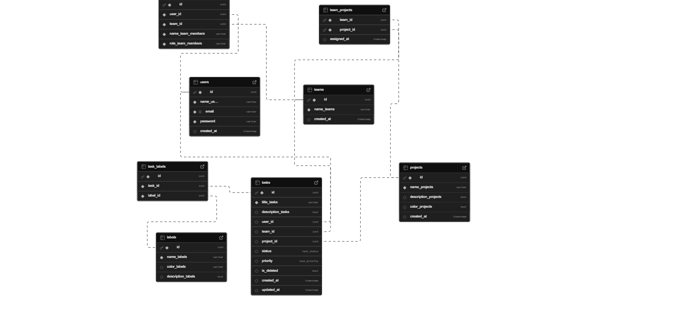
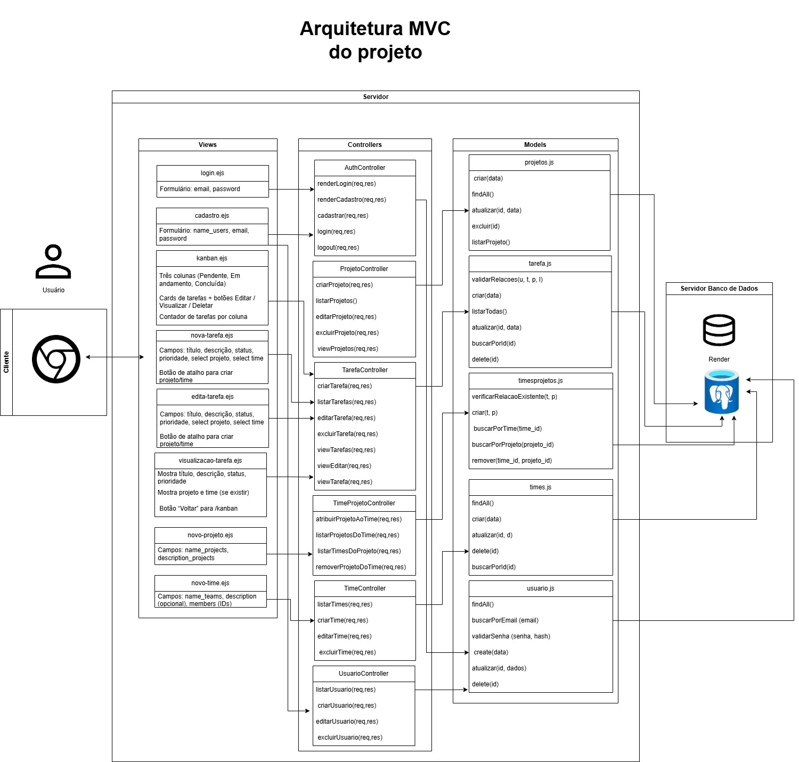

# Web Application Document - Projeto Individual - Módulo 2 - Inteli

#### Autor do projeto
Eduarda Nunes Dias

## Sumário

1. [Introdução](#c1)  
2. [Visão Geral da Aplicação Web](#c2)  
3. [Projeto Técnico da Aplicação Web](#c3)  
4. [Desenvolvimento da Aplicação Web](#c4)  
5. [Referências](#c5)  

<br>

## <a name="c1"></a>1. Introdução 

O sistema proposto consiste em uma aplicação web para gerenciamento de tarefas, desenvolvida com o objetivo de auxiliar usuários que possuem uma rotina intensa e múltiplas responsabilidades. A plataforma permitirá a criação e organização de tarefas, projetos, equipes, etiquetas e anexos, possibilitando também a categorização das atividades por prioridade e status (como pendente, em andamento e concluída), o que contribui diretamente para uma gestão mais eficiente do tempo e das demandas. A interface será projetada para ser simples, prática e intuitiva, garantindo facilidade de uso.


## <a name="c3"></a>3. Projeto da Aplicação Web

### 3.1. Modelagem do banco de dados  
Modelo relacional


O modelo relacional é uma forma estruturada de organizar os dados de um banco por meio de tabelas, onde cada tabela representa uma entidade (como usuários, tarefas ou projetos), com colunas que definem os atributos e linhas que representam os registros. As tabelas se conectam por chaves primárias e estrangeiras, o que permite relacionar as informações sem repetir dados. 


Modelo Físico
```SQL
DO $$ 
BEGIN 
    IF NOT EXISTS (SELECT 1 FROM pg_type WHERE typname = 'task_status') THEN
        CREATE TYPE task_status AS ENUM ('Pendente', 'Em andamento', 'Concluída');
    END IF;
    
    IF NOT EXISTS (SELECT 1 FROM pg_type WHERE typname = 'task_priority') THEN
        CREATE TYPE task_priority AS ENUM ('Baixa', 'Média', 'Alta');
    END IF;
END $$;

CREATE TABLE IF NOT EXISTS users (
  id SERIAL PRIMARY KEY,
  name_users VARCHAR(100) NOT NULL,
  email VARCHAR(100) UNIQUE NOT NULL,
  password VARCHAR(225) NOT NULL,
  created_at TIMESTAMP DEFAULT CURRENT_TIMESTAMP
);

CREATE TABLE IF NOT EXISTS projects (
  id SERIAL PRIMARY KEY,
  name_projects VARCHAR(100) NOT NULL,
  description_projects TEXT,
  color_projects TEXT,
  created_at TIMESTAMP DEFAULT CURRENT_TIMESTAMP
);


CREATE TABLE IF NOT EXISTS teams (
  id SERIAL PRIMARY KEY,
  name_teams VARCHAR(100) NOT NULL,
  created_at TIMESTAMP DEFAULT CURRENT_TIMESTAMP
);

CREATE TABLE IF NOT EXISTS team_projects (
  team_id INT NOT NULL,
  project_id INT NOT NULL,
  assigned_at TIMESTAMP DEFAULT CURRENT_TIMESTAMP,
  PRIMARY KEY (team_id, project_id),
  FOREIGN KEY (team_id) REFERENCES teams(id) ON DELETE CASCADE,
  FOREIGN KEY (project_id) REFERENCES projects(id) ON DELETE CASCADE
);

DO $$
BEGIN
    IF NOT EXISTS (SELECT 1 FROM pg_indexes WHERE indexname = 'idx_team_projects_team') THEN
        CREATE INDEX idx_team_projects_team ON team_projects(team_id);
    END IF;
    IF NOT EXISTS (SELECT 1 FROM pg_indexes WHERE indexname = 'idx_team_projects_project') THEN
        CREATE INDEX idx_team_projects_project ON team_projects(project_id);
    END IF;
END$$;

CREATE TABLE IF NOT EXISTS team_members (
  id SERIAL PRIMARY KEY,
  user_id INT NOT NULL,
  team_id INT NOT NULL,
  name_team_members VARCHAR(100) NOT NULL,
  role_team_members VARCHAR(100) NOT NULL,
  FOREIGN KEY (user_id) REFERENCES users(id) ON DELETE CASCADE,
  FOREIGN KEY (team_id) REFERENCES teams(id) ON DELETE CASCADE
);

CREATE TABLE IF NOT EXISTS tasks (
  id SERIAL PRIMARY KEY,
  title_tasks VARCHAR(225) NOT NULL,
  description_tasks TEXT,
  user_id INT,
  team_id INT,
  project_id INT,
  status task_status DEFAULT 'Pendente',
  priority task_priority DEFAULT 'Média',
  is_deleted BOOLEAN DEFAULT FALSE,
  created_at TIMESTAMP DEFAULT CURRENT_TIMESTAMP,
  FOREIGN KEY (user_id) REFERENCES users(id) ON DELETE SET NULL,
  FOREIGN KEY (team_id) REFERENCES teams(id) ON DELETE SET NULL,
  FOREIGN KEY (project_id) REFERENCES projects(id) ON DELETE SET NULL
);
```
O modelo físico é a etapa onde tudo aquilo que foi pensado no modelo lógico vira código e estrutura real dentro do banco de dados. Nele, definimos exatamente como as tabelas vão ser criadas, os tipos de dados de cada coluna, os índices, restrições e como os dados vão ser armazenados. É onde o banco começa a existir de fato, com comandos SQL que criam as tabelas e relações.


### 3.1.1 BD e Models 
No projeto, foram implementados diversos models para gerenciar as diferentes entidades do banco de dados. Cada model é responsável pela lógica de acesso aos dados e as regras de negócio específicas de cada entidade. Os models implementados no meu projeto são: <br>
**tarefa** -> Responsável pelo gerenciamento das tarefas, ele possui métodos para validar as relações, criar, listar, editar e deletar tarefas.<br>
**usuario** -> Responsável por gerenciar os usuários do sistema, ele possui métodos para criar, editar, deletar e listar os usuários.<br>
**projeto** -> Responsável por controlar os projetos, ele possui métodos para listar, editar, atualizar e deletar projetos.<br>
**time** -> Responsável pela administração dos times, ele possui métodos para listar, criar, atualizar e deletar times.<br>
**timesprojetos** -> Responsáveis por gerenciar as relações entre times - projetos. Isso é necessário devido a terem uma relação N:N, ou seja, um time pode ter vários projetos e um projeto pode pertencer a vários times.

### 3.2. Arquitetura 


**Fluxo de Dados:**

1. **Cliente → Controller**
   - O cliente faz uma requisição HTTP (GET, POST, PUT, DELETE)
   - A requisição é recebida pelo Controller correspondente (tarefaController, labelController...)

2. **Controller → Model**
   - O Controller processa a requisição
   - Chama os métodos apropriados do Model para acessar/modificar dados
   - Exemplo: `tarefaController` chama `TarefaModel.criar()` para uma nova tarefa

3. **Model → Banco de Dados**
   - O Model executa operações no banco via pool de conexões
   - Realiza validações e aplica regras de negócio
   - Retorna os dados/resultados para o Controller

4. **Controller → Cliente**
   - O Controller formata a resposta (JSON)
   - Envia o código HTTP apropriado 
   - Retorna os dados para o cliente

**Componentes:**
- **Model**: Implementa a lógica de negócios e acesso ao banco PostgreSQL
- **Controller**: Gerencia o fluxo de dados e regras de aplicação
- **Rotas**: Define os endpoints
- **Banco de Dados**: Armazena dados em tabelas relacionais
  
### 3.6. WebAPI e endpoints (Semana 05)

O projeto possui os seguintes endpoints:

#### Tarefas
* GET → `/api/tarefas` → Lista todas as tarefas
* POST → `/api/tarefas/criar` → Cria uma nova tarefa
* PUT → `/api/tarefas/edit/:id` → Atualiza uma tarefa existente
* DELETE → `/api/tarefas/delete/:id` → Remove uma tarefa 

#### Etiquetas
* GET → `/api/label` → Lista todas as etiquetas
* POST → `/api/label/criar` → Cria uma nova etiqueta
* PUT → `/api/label/edit/:id` → Atualiza uma etiqueta
* DELETE → `/api/label/delete/:id` → Remove uma etiqueta

#### Relação Tarefas-Etiquetas
* GET → `/api/tasks-labels/task/:task_id` → Lista etiquetas de uma tarefa
* GET → `/api/tasks-labels/label/:label_id` → Lista tarefas com uma etiqueta
* POST → `/api/tasks-labels` → Atribui etiqueta à tarefa
* DELETE → `/api/tasks-labels/:task_id/:label_id` → Remove etiqueta da tarefa

#### Times
* GET → `/api/times` → Lista todos os times
* POST → `/api/times/criar` → Cria um novo time
* PUT → `/api/times/edit/:id` → Atualiza um time
* DELETE → `/api/times/delete/:id` → Remove um time

#### Projetos
* GET → `/api/projetos` → Lista todos os projetos
* POST → `/api/projetos/criar` → Cria um novo projeto
* PUT → `/api/projetos/edit/:id` → Atualiza um projeto
* DELETE → `/api/projetos/delete/:id` → Remove um projeto

#### Usuários
* GET → `/api/usuarios` → Lista todos os usuários
* POST → `/api/usuarios/criar` → Cria um novo usuário
* PUT → `/api/usuarios/edit/:id` → Atualiza um usuário
* DELETE → `/api/usuarios/delete/:id` → Remove um usuário

#### Relação Times-Projetos
* GET → `/api/times-projetos/time/:time_id` → Lista projetos de um time
* GET → `/api/times-projetos/projeto/:projeto_id` → Lista times de um projeto
* POST → `/api/times-projetos` → Vincula time a projeto
* DELETE → `/api/times-projetos/:time_id/:projeto_id` → Remove vínculo time-projeto

### 3.7 Interface e Navegação (Semana 07)
Descreva e ilustre aqui o desenvolvimento do frontend do sistema web, explicando brevemente o que foi entregue em termos de código e sistema. Utilize prints de tela para ilustrar.

## <a name="c3"></a>4. Desenvolvimento da Aplicação Web (Semana 8)
### 4.1 Demonstração do Sistema Web (Semana 8)
VIDEO: Insira o link do vídeo demonstrativo nesta seção Descreva e ilustre aqui o desenvolvimento do sistema web completo, explicando brevemente o que foi entregue em termos de código e sistema. Utilize prints de tela para ilustrar.

### 4.2 Conclusões e Trabalhos Futuros (Semana 8)
Indique pontos fortes e pontos a melhorar de maneira geral. Relacione também quaisquer outras ideias que você tenha para melhorias futuras.

## <a name="c3"></a> 5. Referências
Incluir as principais referências de seu projeto, para que o leitor possa consultar caso ele se interessar em aprofundar.

