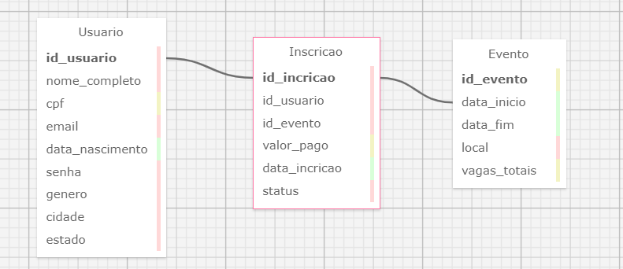

## 📘 Introdução

O presente documento tem como objetivo apresentar a especificação técnica do sistema **AcadEvent**, uma aplicação web desenvolvida com o propósito de facilitar o gerenciamento de eventos acadêmicos, promovendo uma interface prática e funcional tanto para estudantes quanto para instituições de ensino. O projeto foi concebido dentro do paradigma **MVC (Model-View-Controller)**, utilizando tecnologias amplamente adotadas no mercado, como **Node.js**, **Express**, **PostgreSQL** e integração com **Supabase** para gerenciamento do banco de dados.

Este documento detalha os aspectos funcionais e técnicos do sistema, abrangendo desde sua arquitetura até a execução local, visando oferecer uma visão abrangente sobre seu funcionamento e potencial de aplicação no contexto educacional.

## 🗂 Modelo Relacional do Banco de Dados

A imagem a seguir ilustra o modelo relacional utilizado pelo sistema **AcadEvent**, representando a estrutura das tabelas, seus relacionamentos e os principais campos do banco de dados. Esse diagrama é essencial para compreender a organização lógica dos dados e como as entidades se conectam no contexto do gerenciamento de eventos acadêmicos.

